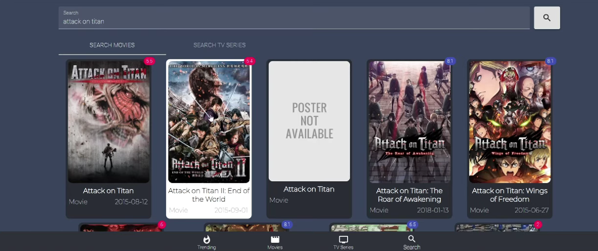

# CineFlix
The project is a MERN Stack based web application that allows users to browse and search for movies and TV series. It provides trending content, movies, and TV series pages, and a search functionality. Users can explore different genres, view details of individual movies or TV series, and watch trailers. It also gives users the capability of filtering through movies and shows by selecting speciifc genres. A signing up feature is also included which requires MongoDB connectivity.

# Languages and Frameworks/Libraries
The project is developed using the following technologies:

* **Languages:** ReactJS, NodeJS, ExpressJS, MongoDB, HTML, CSS
* **Frameworks/Libraries:** Material-UI, react-router-dom, axios

# Installation and Execution
To run the project locally, follow these steps:

1. Clone the repository from GitHub.
2. Navigate to the project directory in your terminal.
3. Run the command below to install the project dependencies:
```
npm install
```
4. Create a **.env** file and add your API key from **themoviedb.org** as **REACT_APP_API_KEY=your_api_key**.
5. Run the command below to start the development server:
```
npm start
```
6. Open your browser and access the project at http://localhost:3000.
7. Connect MongoDB to access details of users who have successfully signed up.

# Configuration
1. Upon accessing the project, you will see a header with navigation links.
2. The home page shows trending content.
3. Click on the "Movies" or "Series" link in the navigation to browse movies or TV series.
4. Use the search bar to search for specific movies or TV series.
5. On the movies or series pages, you can select genres to filter the content.
6. Click on a movie or TV series card to view more details, including a description and cast members.
7. You can also watch the trailer for a movie or TV series by clicking the "Watch the Trailer" button.
8. A sign up page allows users to sign up to the website and users who have successfully signed up are shown a sign up success page.
9. Details of these users can be collected through MongoDB.

# Snapshots
## Trending Page


## Search Page


## Content Modal


## Successfully Signed-Up User Data on MongoDB


# Conclusion
This project provides a user-friendly interface for browsing and searching movies and TV series. It leverages React and Material-UI for a responsive and visually appealing design. With the provided features, users can easily discover new content, explore different genres, and get more information about movies and TV series.
